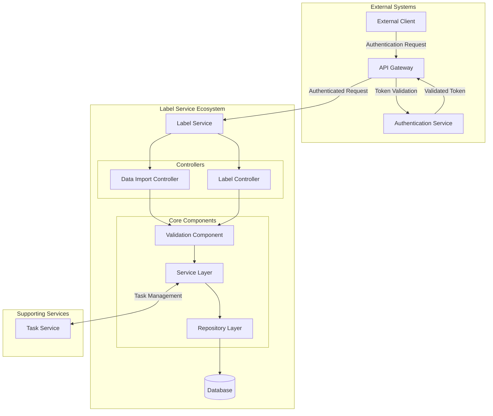
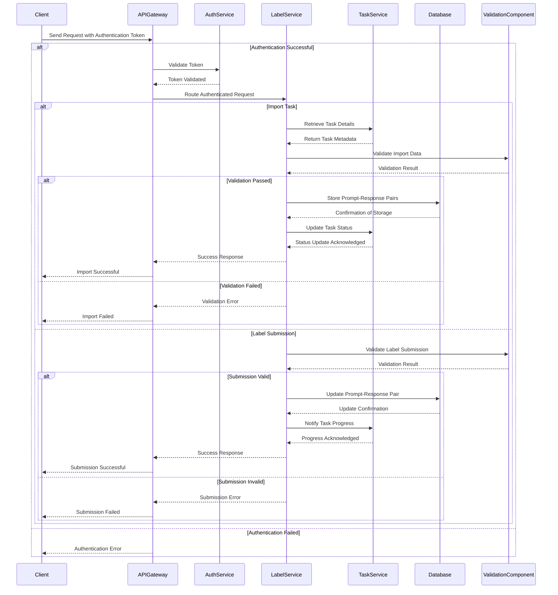

# Label Service for AfrikAI

## Project Overview

### Purpose
The Label Service is a core microservice within the AfrikAI application, designed to handle labeling tasks with a flexible, extensible architecture. By following the design principles implemented here, the service provides a robust framework for processing and managing prompt-response pairs (PRPs) across various task categories.

### Core Functions
- Process labeling tasks forwarded by the Task Service via multipart file uploads
- Provide endpoints to import and manage prompt-response pairs (PRPs)
- Handle labeling submissions, reviews, and task status updates

### Security Approach
While the current implementation permits all requests, security is strategically managed:
- Authentication and authorization are enforced at the API Gateway
- Token validation is routed through the Auth Service in the User Microservice
- Future enhancements will include direct service-level access controls

## Service Design and Relationships

### Endpoint Architecture
#### Base Route: `/api/labels`

**Data Import Controller**:
- `POST /import`: Processes file uploads (JSON, CSV, XLS)
- `GET /prompt-response-pairs`: Retrieves prompt-response pairs by various identifiers

**Label Controller**:
- `POST /submit`: Submits ratings and updates PRP status
- `POST /review`: Allows user reviews of PRPs

### Technology Stack
- **Backend**: Spring Boot
- **Programming Paradigm**: Reactive programming with Spring WebFlux
- **Code Enhancement**: Lombok annotations

### Service Integrations
- **Task Service**: Forwards and manages task processing
- **API Gateway**: Handles authentication and routing
- **Auth Service**: Performs token authentication

### Swagger Documentation
Interactive API documentation available at: `http://localhost:8083/swagger-ui.html`

## Installation Guide

### Prerequisites
- Java 17 or later
- Maven

### Setup Steps
1. Clone the repository:
   ```bash
   git clone https://github.com/Nadira3/afrikai_apis.git
   ```

2. Navigate to project directory:
   ```bash
   cd label-service
   ```

3. Build the project:
   ```bash
   mvn clean install
   ```

4. Run the service:
   ```bash
   mvn spring-boot:run
   ```

5. Access Swagger Documentation:
   Open `http://localhost:8083/swagger-ui.html` in your browser

## Usage Guidelines

### Task Import
- Utilize `/import` endpoint for multipart file uploads
- Supported formats: JSON, CSV, XLS

### Labeling Tasks
- Use `/submit` for rating prompt-response pairs
- Employ `/review` for PRP evaluation

## Execution Flow

### Label Service Interactions


### Detailed Service Sequence


## License
ALX Backend Specialization Curriculum License

## Future Enhancements
- Implement role-based access control
- Extend support for additional task categories
- Develop direct authorization filters within the service

## Contributing
Please read our contribution guidelines before submitting pull requests.

## Contact
For questions or support, contact the AfrikAI development team.
