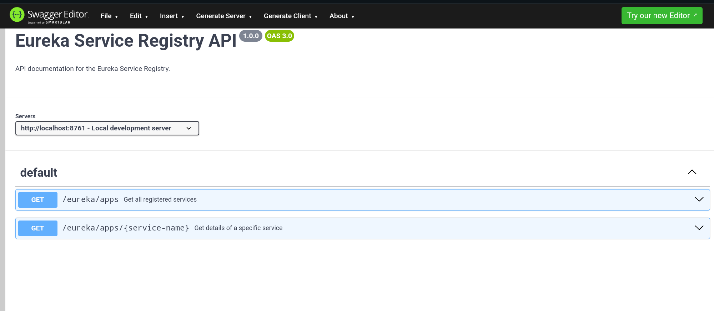

# Service Registry with Netflix Eureka Server

## API Documentation

This project uses OpenAPI to document the Service Registry endpoints. The documentation is rendered using Swagger UI, allowing users to view and test the API interactively.

Below is a screenshot of the Swagger UI:



To view the documentation in your browser, follow these steps:
1. Ensure the service is running.
2. Open Swagger UI at `http://localhost:<port>/swagger-ui.html`.
3. Test the endpoints directly using the "Try it out" feature.

For more details, refer to the [OpenAPI Specification](service-registry-openapi.yml).

## Overview
The Service Registry is a crucial component in our microservices architecture, powered by Netflix Eureka Server. It acts as a central directory that maintains a dynamic registry of all microservices in the ecosystem. This enables automatic service discovery, registration, and load balancing, eliminating the need for hardcoded service locations and allowing for dynamic scaling of the application landscape.

## Features
- **Dynamic Service Registration**: Automatic registration of new service instances
- **Service Discovery**: Enables services to locate and communicate with each other without hardcoded URLs
- **Health Monitoring**: Built-in health checks for registered services
- **Fault Tolerance**: Automatic handling of service failures and rebalancing
- **Dashboard UI**: Web-based interface for monitoring service registry status
- **Self-Preservation**: Protection against network partitions and mass service de-registration
- **REST API**: RESTful endpoints for service registry operations

## Technical Specifications
- **Java Version**: 17
- **Framework**: Spring Boot
- **Discovery Server**: Netflix Eureka Server
- **Communication**: HTTP/REST
- **Default Port**: 8761
- **Registry Protocol**: Netflix Eureka Client-Server protocol

## Application Flow
1. **Service Registration**:
   - Services start up with Eureka Client configuration
   - Automatically register themselves with the Eureka Server
   - Provide metadata including host, port, and health indicators

2. **Service Discovery**:
   - Client services query the registry to discover other services
   - Registry provides up-to-date service locations
   - Load balancing handled through client-side routing

3. **Health Monitoring**:
   - Regular heartbeat checks between services and registry
   - Automatic removal of unhealthy instances
   - Self-preservation mode during network issues

## Setup Instructions

### Prerequisites
- Java 17 or higher
- Maven 3.6+ or Gradle
- Spring Boot 3.x

### Configuration Steps
1. Add the following dependencies to your `pom.xml`:
```xml
<dependency>
    <groupId>org.springframework.cloud</groupId>
    <artifactId>spring-cloud-starter-netflix-eureka-server</artifactId>
</dependency>
```

2. Configure `application.properties`:
```properties
spring.application.name=eureka-server
server.port=8761
eureka.client.fetch-registry=false
eureka.client.register-with-eureka=false
```

3. Add `@EnableEurekaServer` annotation to your main application class:
```java
@SpringBootApplication
@EnableEurekaServer
public class ServiceRegistryApplication {
    public static void main(String[] args) {
        SpringApplication.run(ServiceRegistryApplication.class, args);
    }
}
```

4. Run the application using:
```bash
mvn spring-boot:run
```

### Accessing the Dashboard
Once running, access the Eureka Dashboard at:
```
http://localhost:8761
```

## Benefits
- **Enhanced Scalability**: Easily add or remove service instances without configuration changes
- **Improved Resilience**: Automatic failover and load balancing
- **Simplified Management**: Centralized view of all services
- **Reduced Complexity**: No need for hardcoded service URLs
- **Better Maintainability**: Easy monitoring and troubleshooting
- **Cloud Ready**: Designed for cloud-native applications

## Client Configuration
For services to register with Eureka Server, they need:

1. Eureka Client dependency:
```xml
<dependency>
    <groupId>org.springframework.cloud</groupId>
    <artifactId>spring-cloud-starter-netflix-eureka-client</artifactId>
</dependency>
```

2. Client properties:
```properties
eureka.client.serviceUrl.defaultZone=http://localhost:8761/eureka/
spring.application.name=your-service-name
```

## Additional Notes
- Ensure proper network connectivity between services and the registry
- Consider running multiple registry instances for high availability
- Monitor the self-preservation threshold in production environments
- Regularly check the Eureka dashboard for service health
- Configure appropriate timeouts for service registration/discovery
- Implement circuit breakers for enhanced fault tolerance

## Contributing
Please read CONTRIBUTING.md for details on our code of conduct and the process for submitting pull requests.

## License
This project is licensed under the ALX Backend Curriculum
