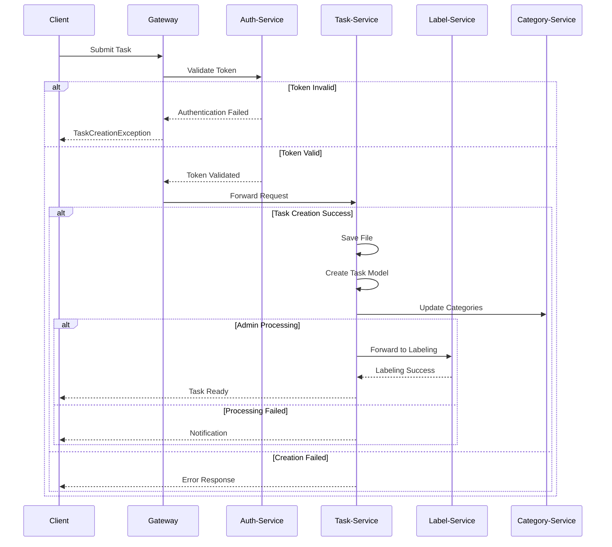

# Task-Service for AfrikAI Application

## Overview

The Task-Service is a core component of the AfrikAI application, responsible for managing task lifecycles from creation through completion. It handles task uploads, processing workflows, and integrates with other services through a secure gateway architecture.

## System Architecture

### Gateway Integration
- Acts as the primary entry point for all task-related operations
- Handles authentication by forwarding tokens to the auth-service
- Provides secure routing to the task-service after successful validation
- Throws TaskCreationException on authentication failures

### Task-Service Core Functions
- Manages task file storage in `upload_dir` using the format `<task_id>-<task_name>`
- Implements role-based authorization for administrative operations
- Maintains task status throughout the processing lifecycle
- Integrates with:
  - Label-Service: Handles task labeling workflows
  - Category-Service: Manages task categorization and updates

## Features

### Task Management
- Complete CRUD operations for task entities
- Advanced filtering capabilities:
  - Status-based filtering
  - Category filtering
  - Priority levels
  - Task ID lookup
- Secure file upload system with organized storage
- Comprehensive task processing workflow

### Processing Workflow
1. Client Upload Phase
   - Creates generic task model
   - Validates input parameters
   - Stores associated files

2. Administrative Processing
   - Review and approval by admin users
   - Successful processing triggers label-service integration
   - Failed processing updates status and notifies clients

3. Task Assignment
   - Automated assignment to qualified users
   - Gateway-managed access control
   - Real-time status tracking

## Technical Details

### Service Configuration
```
server:
  port: 8082
  servlet:
    context-path: /api/tasks

spring:
  application:
    name: task-service
  datasource:
    url: jdbc:mysql://localhost:3306/afrikai_db
    username: ${MYSQL_USER}
    password: ${MYSQL_PASSWORD}
  jpa:
    hibernate:
      ddl-auto: update

upload:
  dir: ${UPLOAD_DIR:/tmp/afrikai/tasks}
```

### Dependencies
```xml
<dependencies>
    <!-- Spring Boot -->
    <dependency>
        <groupId>org.springframework.boot</groupId>
        <artifactId>spring-boot-starter-web</artifactId>
    </dependency>
    <dependency>
        <groupId>org.springframework.boot</groupId>
        <artifactId>spring-boot-starter-data-jpa</artifactId>
    </dependency>
    
    <!-- Security -->
    <dependency>
        <groupId>org.springframework.boot</groupId>
        <artifactId>spring-boot-starter-security</artifactId>
    </dependency>
    
    <!-- Documentation -->
    <dependency>
        <groupId>org.springdoc</groupId>
        <artifactId>springdoc-openapi-ui</artifactId>
        <version>2.3.0</version>
    </dependency>
</dependencies>
```

## Installation

### Prerequisites
- Java 17 or higher
- Maven 3.6+
- PostgreSQL 12+ or MySQL
- Docker (optional)

### Standard Installation
```bash
# Clone the repository
git clone https://github.com/Nadira3/afrikai_apis.git

# Navigate to project directory
cd afrikai-task-service

# Set execute permissions for Maven wrapper
chmod +x mvnw

# Build and install dependencies
./mvnw clean install

# Start the service
./mvnw spring-boot:run
```

The service will be available at:
- Gateway URL: `http://localhost:8080/api/tasks`
- Swagger UI: `http://localhost:8082/swagger-ui.html`

## Authorization

### Security Model
- Gateway-enforced authentication
- Token-based access control
- Role-based authorization at service level

### Access Levels
- Client: Task creation and viewing
- Admin: Processing and management
- Tasker: Task labeling and review

### Security Configuration
```java
    @Bean
    public SecurityFilterChain securityFilterChain(HttpSecurity http) throws Exception {
        http
            .csrf(csrf -> csrf.disable())
            .sessionManagement(session -> session.sessionCreationPolicy(SessionCreationPolicy.STATELESS))
            .addFilterBefore(securityContextFilter(), UsernamePasswordAuthenticationFilter.class)
            .authorizeHttpRequests(auth -> auth
                .requestMatchers("/api/tasks/client/**").hasRole("CLIENT")
                .requestMatchers("/api/tasks/user/**").hasRole("TASKER")
                .requestMatchers("/api/tasks/admin/**").hasRole("ADMIN")
                .requestMatchers(
                        "/swagger-ui/**",
                        "/swagger-ui.html/**",
                        "/webjars/**",
                        "/v3/api-docs/**"
                )
                .permitAll() // Allow access to the Swagger UI and the authentication endpoint
                .anyRequest().authenticated()
            );
        return http.build();
    }
```

## API Documentation

### Task Management Endpoints

#### POST /api/v1/tasks
Creates a new task
```json
{
  "name": "string",
  "category": "string",
  "priority": "HIGH|MEDIUM|LOW",
  "description": "string",
  "files": ["multipart/form-data"]
}
```

Response:
```json
{
  "taskId": "uuid",
  "status": "CREATED",
  "created": "timestamp"
}
```

#### GET /api/v1/tasks/{taskId}
Retrieves task details
```json
{
  "taskId": "uuid",
  "title": "string",
  "category": "string",
  "priority": "HIGH|MEDIUM|LOW",
  "status": "CREATED|PROCESSING|COMPLETED|FAILED",
  "createdAt": "timestamp"
}
```

#### PUT /api/v1/tasks/{taskId}/process
Initiates task processing
```json
{
  "filePath": "string",
  "clientId": "string",
  "taskId: ["uuid"]
}
```

#### PUT /api/v1/tasks/{taskId}/complete
Marks task as complete
```json
{
  "taskId": uuid
}
```

#### GET /api/v1/tasks/filter
Filter tasks by criteria
```
Query Parameters:
- status: string
- category: string
- priority: string
- assignedTo: uuid
- deadline: datetime
```

## Error Handling

### Common Error Responses
```json
{
  "status": "number",
  "message": "string",
  "timestamp": "string",
}
```

### Error Types
1. TaskCreationException (HTTP 400)
   - Invalid file format
   - Missing required fields
   - Storage failures

2. TaskNotFoundException (HTTP 404)
   - Invalid task ID
   - Deleted task access

3. AuthorizationException (HTTP 403)
   - Invalid token
   - Insufficient permissions

4. ProcessingException (HTTP 500)
   - Service integration failures
   - System errors

## Execution Flow

