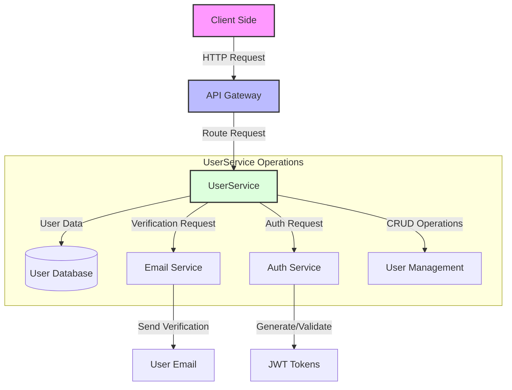

# UserService for AfrikAI Application

## Overview
The UserService is a core microservice component of the AfrikAI application that handles user management, authentication, and registration functionalities. It provides secure user operations while integrating with email verification and authentication services.

## Installation

### Prerequisites
- Java 17 or higher
- Maven
- Git

### Setup Steps

1. Clone the repository:
```bash
git clone <repo-url>
```

2. Navigate to the service directory:
```bash
cd <service-registry-directory>
```

3. Set proper permissions:
```bash
chmod +x mvn
```

4. Build and install:
```bash
mvn clean install
```

5. Run the application:
```bash
mvn spring-boot:run
```

The service will start on port 8081.

## Usage

### Registration
The register endpoint is publicly accessible and does not require authentication. Upon successful registration, a JWT token is issued for subsequent authenticated requests.

### Authentication
All other endpoints require JWT authentication. Tokens can be obtained through:
- User registration
- Login endpoint

### Architecture Design


### Independent Testing
To test the service independently (bypassing the gateway):
1. Open `SecurityConfig.java` in the security package
2. Modify the request/exchange configuration from `authenticated()` to `permitAll()`

## API Documentation
Interactive API documentation is available via Swagger UI:
- URL: http://localhost:8081/swagger-ui.html
- Comprehensive endpoint documentation
- Request/response examples
- Testing interface

## Security Features
- JWT-based authentication
- Role-based access control
- Secure password hashing
- Token expiration and refresh mechanisms
- Cross-Origin Resource Sharing (CORS) configuration

## Technology Stack
- Spring Boot
- Spring Security
- JWT (JSON Web Tokens)
- Swagger UI
- Mermaid.js
- Maven
- MySQL

## License
This project is licensed under the ALX Backend Curriculum license.

## Contributing
We welcome contributions to improve the UserService. Please follow these steps:

1. Fork the repository
2. Create a feature branch
3. Commit your changes
4. Push to your branch
5. Open a Pull Request

## Contact
Project Maintainer: [Nadira3](https://github.com/Nadira3)
